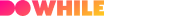

  

<h3 align="center">
  NLW Heat 7
</h3>

  <a href="./api">Back-end</a>&nbsp;&nbsp;&nbsp;|&nbsp;&nbsp;&nbsp;
  <a href="./web">Front-end</a>&nbsp;&nbsp;&nbsp;|&nbsp;&nbsp;&nbsp;
  <a href="./app">App</a>&nbsp;&nbsp;&nbsp;|&nbsp;&nbsp;&nbsp;
  <a href="./heat_tags">Micro Serviço</a>&nbsp;&nbsp;&nbsp;|&nbsp;&nbsp;&nbsp;
  <a href="https://www.figma.com/file/KSrKaw6JYH2aCK9pozMk9P/%5BNLW-Heat---Mission%3A-Impulse%5D-DoWhile2021-(Community)?node-id=0%3A1">Projeto no Figma</a>

  

  
  
    

## :memo: Sobre o projeto
Durante a NLW Heat 7 foi desenvolvida uma aplicação utilizando React, React Native, NodeJs e Elixir para realizar o cadastro de mensagens durante a Do While 2021
